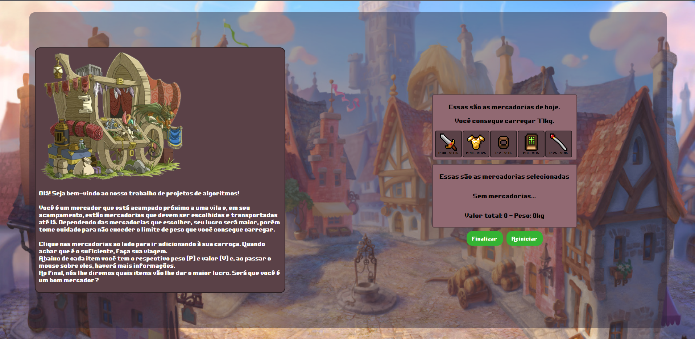
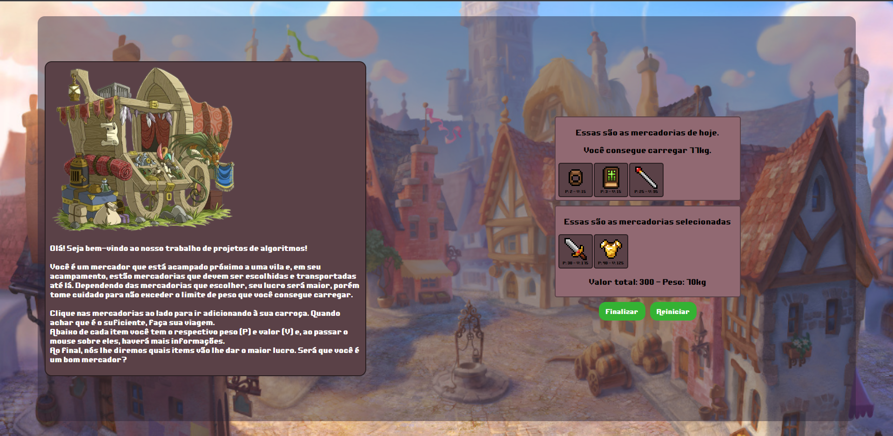
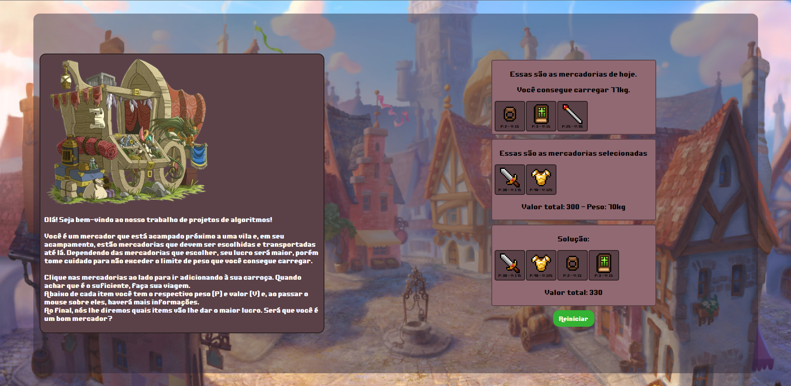

# Village Merchant

**Número da Lista**: 3<br>
**Conteúdo da Disciplina**: Greed<br>

## Alunos
|Matrícula | Aluno |
| -- | -- |
| 16/0127891  |  João Vitor de Moura Rosa Silva |
| 16/0016169  |  Nícalo Ribeiro Dourado Araújo |

## Sobre 
O nosso projeto utiliza o algoritmo do knapsack para, a partir de uma lista de itens com seu respectivo peso e valor, determinar quais elementos vão possuir o maior valor com um peso limite.  
Com isso, nós criamos um jogo em que simulamos ser um mercador. A cada rodada, haverá uma lista de mercadorias e um peso máximo a ser carregado pelo mercador. Cada item possui um valor e um peso. O objetivo é preencher a carroça com os itens que dão o maior lucro, respeitando o peso máximo que pode ser carregado.  
A cada rodada, os itens e o peso máximo mudam e o programa determina qual seria a melhor opção a partir dos itens e peso máximo da vez. Após selecionar os itens, basta clicar em finalizar e a solução será mostrada.

## Vídeo de apresentação  
[Vídeo de apresentacao](screenshots/Greed-Dupla30.mp4)  
Caso o link não funcione, o vídeo está dentro da pasta 'screenshots' e tem o nome de 'Greed-Dupla30.mp4'.
Outra opção é [esse link da apresentação.](https://unbbr-my.sharepoint.com/:v:/r/personal/160016169_aluno_unb_br/Documents/Grava%C3%A7%C3%B5es/Greed%20-%20Dupla%2030-20220307_201418-Grava%C3%A7%C3%A3o%20de%20Reuni%C3%A3o.mp4?csf=1&web=1&e=V03Cpx)

## Screenshots







## Instalação 
**Linguagem**: Javascript<br>
**Framework**: ReactJs<br>
**Requisitos**: NPM ou Yarn<br>

## Uso 
```
npm install OU yarn install
```

```
npm start OU yarn start
```

## Outros 
A partir de uma lista de itens, o programa executa um algoritmo de knapsack e disponibiliza quais seriam os itens que agregam o maior valor respeitando um peso limite. A partir disso, temos o jogo que foi descrito acima.


